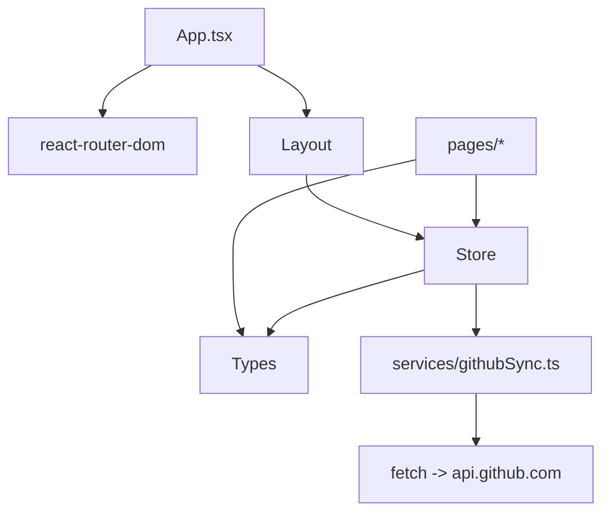

# Code Wiki：面试通（Interview Pro）

## 1. 项目简介

面试通（Interview Pro）是一个基于 **React 18 + Vite + TypeScript + Tailwind CSS + Zustand** 的轻量级面试题管理与刷题平台，核心存储策略为 **“纯内存运行 + GitHub Gist 私有云同步”**，用于避免浏览器本地存储（如 IndexedDB）带来的清缓存/换设备丢失问题。

- 产品说明：[README.md](file:///workspace/README.md)
- 主要入口：[index.html](file:///workspace/index.html) → [main.tsx](file:///workspace/src/main.tsx) → [App.tsx](file:///workspace/src/App.tsx)

## 2. 技术栈与依赖

### 2.1 运行时依赖（dependencies）

依赖清单见：[package.json](file:///workspace/package.json)

- React 生态：react、react-dom、react-router-dom（HashRouter）
- 状态管理：zustand（含 persist middleware）
- 样式与 UI：tailwindcss、tailwind-merge、clsx、lucide-react（图标）、framer-motion（动效）
- 内容渲染：react-markdown + remark-gfm + highlight.js（Markdown + 代码高亮）
- 工具：uuid（生成题目 ID）、date-fns（时间工具）、xlsx（Excel/CSV 读写）

### 2.2 工程化依赖（devDependencies）

- 构建：vite（见 [vite.config.ts](file:///workspace/vite.config.ts)）
- TypeScript：typescript（项目级配置见 [tsconfig.json](file:///workspace/tsconfig.json)）
- Lint：eslint + typescript-eslint（配置见 [eslint.config.js](file:///workspace/eslint.config.js)）
- Tailwind：postcss + autoprefixer（配置见 [postcss.config.js](file:///workspace/postcss.config.js)、[tailwind.config.js](file:///workspace/tailwind.config.js)）

## 3. 目录结构与模块职责

```
.
├─ public/                        静态资源（favicon 等）
├─ src/
│  ├─ assets/                     资源
│  ├─ components/                 复用组件（布局、空态等）
│  ├─ hooks/                      通用 hooks
│  ├─ lib/                        通用工具函数
│  ├─ pages/                      页面（路由目标）
│  ├─ services/                   外部服务封装（GitHub API）
│  ├─ store/                      全局状态（Zustand）
│  ├─ types/                      数据模型（Question 等）
│  ├─ App.tsx                     应用根组件 / 路由配置
│  └─ main.tsx                    React 启动入口
└─ .github/workflows/             CI/CD（GitHub Pages）
```

核心模块映射：

- 路由与页面： [App.tsx](file:///workspace/src/App.tsx)、[pages/](file:///workspace/src/pages)
- 应用布局： [Layout.tsx](file:///workspace/src/components/Layout.tsx)
- 全局状态/数据中心： [store/index.ts](file:///workspace/src/store/index.ts)
- 云同步服务： [githubSync.ts](file:///workspace/src/services/githubSync.ts)
- 数据模型： [types/index.ts](file:///workspace/src/types/index.ts)

## 4. 整体架构（Runtime Architecture）

### 4.1 启动链路

1. 浏览器加载 [index.html](file:///workspace/index.html) 并挂载 `#root`
2. [main.tsx](file:///workspace/src/main.tsx) 使用 `createRoot(...).render(<App />)`
3. [App.tsx](file:///workspace/src/App.tsx)：
   - 使用 `HashRouter` 组织页面路由
   - 读取 store 中的 `theme`，同步到 `document.documentElement.classList`
   - 若已配置 `githubToken + gistId`，启动时执行 `fetchFromCloud()` 拉取题库

### 4.2 关键数据流（题库与同步）

这套应用把题库的“权威数据”放在 GitHub Gist，Zustand store 作为运行时内存态。UI 通过 store 读写题库，store 负责触发自动同步。

```mermaid
flowchart LR
  UI[pages/components] -->|useAppStore| STORE[Zustand Store]
  STORE -->|pull| GIST[(GitHub Gist)]
  STORE -->|push| GIST
  STORE -->|persist(partialize)| LS[(localStorage)]
```

- 题库数据：`questions: Question[]`（默认不持久化到 localStorage）
- 持久化配置：仅持久化 UI 与云端配置（sidebar/theme/token/gistId），见 [store/index.ts](file:///workspace/src/store/index.ts#L43-L170)

## 5. 路由与页面（Pages）

路由表位于 [App.tsx](file:///workspace/src/App.tsx#L45-L58)：

- `/`：数据统计面板 [Dashboard.tsx](file:///workspace/src/pages/Dashboard.tsx)
- `/questions`：题库管理列表 [QuestionList.tsx](file:///workspace/src/pages/QuestionList.tsx)
- `/questions/new`：新建题目 [QuestionEditor.tsx](file:///workspace/src/pages/QuestionEditor.tsx)
- `/questions/edit/:id`：编辑题目 [QuestionEditor.tsx](file:///workspace/src/pages/QuestionEditor.tsx)
- `/practice`：刷题范围选择 [PracticeSettings.tsx](file:///workspace/src/pages/PracticeSettings.tsx)
- `/practice/session?mode=...`：刷题会话（闪卡）[PracticeSession.tsx](file:///workspace/src/pages/PracticeSession.tsx)
- `/settings`：数据设置（云同步/导出）[Settings.tsx](file:///workspace/src/pages/Settings.tsx)

布局与导航：

- 主布局（侧边栏/主题切换/同步状态展示）：[Layout.tsx](file:///workspace/src/components/Layout.tsx)
- 注意：刷题会话页 `/practice/session` 不使用 Layout 包裹，保证沉浸式体验（见 [App.tsx](file:///workspace/src/App.tsx#L55-L57)）

## 6. 状态管理（Zustand Store）

### 6.1 Store 入口与持久化策略

Store 定义在 [store/index.ts](file:///workspace/src/store/index.ts)。

- `persist` key：`interview-pro-ui`（localStorage）
- `partialize`：仅保存 `sidebarOpen/theme/githubToken/gistId`，避免把题库本体写入 localStorage

### 6.2 状态字段（核心）

见 [AppState](file:///workspace/src/store/index.ts#L6-L41)：

- UI：`sidebarOpen`、`theme`
- 云配置：`githubToken`、`gistId`
- 数据：`questions`
- 同步状态：`isInitializing`、`isSyncing`、`lastSyncTime`、`syncError`

### 6.3 关键动作（核心 API）

见实现：[store/index.ts](file:///workspace/src/store/index.ts#L62-L160)

- `fetchFromCloud()`：从 Gist 拉取 `{version, questions}` 并写入 `questions`
- `syncToCloud()`：把 `{version: 2, questions}` 推送到 Gist；如 `gistId` 为空则创建新 Gist，并回写 `gistId`
- `triggerAutoSync()`：当前实现为直接调用 `syncToCloud()`（无 debounce）
- CRUD：
  - `addQuestion/updateQuestion/deleteQuestion`
  - `bulkAddQuestions/bulkUpdateQuestions/bulkDeleteQuestions`
  - `setQuestions/clearData`
  - 以上写操作都会触发 `triggerAutoSync()`

## 7. 云同步（GitHub Gist）

同步服务封装位于：[githubSync.ts](file:///workspace/src/services/githubSync.ts)

### 7.1 数据格式

- 文件名：`interview-pro-backup.json`（常量 `FILENAME`，见 [githubSync.ts](file:///workspace/src/services/githubSync.ts#L1-L1)）
- 内容：`{ version: 2, questions: Question[] }`（见 [store/index.ts](file:///workspace/src/store/index.ts#L86-L87)、[Settings.tsx](file:///workspace/src/pages/Settings.tsx#L51-L52)）

### 7.2 API 行为

- `pushToGist(token, gistId, data)`：
  - `gistId` 存在：PATCH `https://api.github.com/gists/:id`
  - `gistId` 为空：POST `https://api.github.com/gists` 创建私有 Gist，并返回新 id
  - 实现见：[githubSync.ts](file:///workspace/src/services/githubSync.ts#L3-L45)
- `pullFromGist(token, gistId)`：
  - 读取 Gist 并解析目标文件内容
  - 对 `truncated` 文件：使用 `raw_url` 重新 fetch
  - 实现见：[githubSync.ts](file:///workspace/src/services/githubSync.ts#L47-L73)

### 7.3 配置入口

用户通过数据设置页配置 Token/GistId，并可手动 push/pull：

- [Settings.tsx](file:///workspace/src/pages/Settings.tsx#L10-L88)

安全注意：

- Token 会被持久化到 localStorage（persist partialize），属于“浏览器侧明文存储”的风险点；建议使用最小权限 Token（仅勾选 `gist`），并妥善保管。

## 8. 数据模型（Question）

核心模型定义于：[types/index.ts](file:///workspace/src/types/index.ts)

```ts
interface Question {
  id: string;
  title: string;
  content: string;          // Markdown
  answer: string;           // Markdown
  tags: string[];
  difficulty: 'easy' | 'medium' | 'hard';
  masteryLevel: 0 | 1 | 2;
  lastReviewedAt: number;
  reviewCount: number;
  nextReviewAt: number;
  intervalDays: number;
  easeFactor: number;
  createdAt: number;
  updatedAt: number;
}
```

含义要点：

- `masteryLevel`：掌握程度（0 新题/未掌握，1 模糊/学习中，2 熟练/已掌握）
- `easeFactor/intervalDays/nextReviewAt`：用于间隔重复（SM-2 简化版）的复习调度

## 9. 刷题算法与会话（Practice）

### 9.1 刷题范围选择

- 页面：[PracticeSettings.tsx](file:///workspace/src/pages/PracticeSettings.tsx)
- 模式：
  - `all`：全部题目
  - `new`：`masteryLevel === 0`
  - `review`：`nextReviewAt <= now`

### 9.2 闪卡会话与调度更新

- 页面：[PracticeSession.tsx](file:///workspace/src/pages/PracticeSession.tsx)
- 题目筛选 + 洗牌：见 [PracticeSession.tsx](file:///workspace/src/pages/PracticeSession.tsx#L38-L70)
- 掌握度更新（核心调度逻辑）：`handleMastery(level)`，见 [PracticeSession.tsx](file:///workspace/src/pages/PracticeSession.tsx#L74-L116)

调度规则（概念化总结）：

- level=0（未掌握）：降低 `easeFactor`，`intervalDays=1`
- level=1（概念模糊）：降低 `easeFactor`，间隔温和增长（`intervalDays * 1.5` 或默认 2）
- level=2（熟练掌握）：提升 `easeFactor`，间隔按 `intervalDays * easeFactor` 放大（首次默认 3）
- `nextReviewAt = now + intervalDays * day`

更新动作通过 `updateQuestion()` 写入 store，因此会触发自动云同步（见 [store/index.ts](file:///workspace/src/store/index.ts#L110-L115)）。

## 10. 题库管理（导入/导出/批量）

题库列表页面：[QuestionList.tsx](file:///workspace/src/pages/QuestionList.tsx)

### 10.1 搜索与过滤

- 支持按难度、掌握度、标签过滤；标题与标签模糊搜索
- 数据排序：按 `createdAt` 倒序

实现入口见：[QuestionList.tsx](file:///workspace/src/pages/QuestionList.tsx#L47-L65)

### 10.2 Excel/CSV 导入

实现入口：

- 上传解析：[handleFileUpload()](file:///workspace/src/pages/QuestionList.tsx#L157-L208)
- 导入确认：[confirmImport()](file:///workspace/src/pages/QuestionList.tsx#L215-L246)

关键点：

- 支持字段别名：中文（题目名称/难度/标签/题目描述/答案与解析）与英文（title/difficulty/tags/content/answer）
- 去重策略：`signature = normalized(title) + '||' + normalized(answer)`（见 [QuestionList.tsx](file:///workspace/src/pages/QuestionList.tsx#L91-L96)）
- 导入模式：
  - `skip_duplicates`：跳过重复行
  - `allow_duplicates`：允许重复（仍要求必填字段合法）
- 新导入题目初始化：`masteryLevel=0`、`reviewCount=0`、`easeFactor=2.5` 等（见 [QuestionList.tsx](file:///workspace/src/pages/QuestionList.tsx#L225-L241)）

### 10.3 导出

- 导出 Excel：见 [exportExcel()](file:///workspace/src/pages/QuestionList.tsx#L130-L142)
- 导出 CSV：见 [exportCsv()](file:///workspace/src/pages/QuestionList.tsx#L144-L155)
- 模板下载：见 [downloadTemplate()](file:///workspace/src/pages/QuestionList.tsx#L120-L128)

### 10.4 批量操作

- 批量删除：`bulkDelete()`（见 [QuestionList.tsx](file:///workspace/src/pages/QuestionList.tsx#L263-L268)）
- 批量改难度：`handleBulkChangeDifficulty()`（见 [QuestionList.tsx](file:///workspace/src/pages/QuestionList.tsx#L270-L279)）
- 批量追加标签：`handleBulkAddTags()`（见 [QuestionList.tsx](file:///workspace/src/pages/QuestionList.tsx#L281-L299)）

这些批量操作均通过 store 的 bulk API 更新，最终触发自动云同步。

## 11. Markdown 渲染与编辑体验

题目编辑页：[QuestionEditor.tsx](file:///workspace/src/pages/QuestionEditor.tsx)

- 表单：`react-hook-form` 管理，创建/编辑共用一个页面
- Markdown：`react-markdown + remark-gfm` 渲染
- 代码高亮：`highlight.js`（通过自定义 `MarkdownComponents.code`，见 [QuestionEditor.tsx](file:///workspace/src/pages/QuestionEditor.tsx#L28-L37)）
- 新建题目初始化：见 [onSubmit()](file:///workspace/src/pages/QuestionEditor.tsx#L79-L110)

刷题会话页也复用了类似的 Markdown 组件（见 [PracticeSession.tsx](file:///workspace/src/pages/PracticeSession.tsx#L13-L22)）。

## 12. 组件与工具函数

- Layout（布局/导航/状态指示）：[Layout.tsx](file:///workspace/src/components/Layout.tsx)
- Tailwind class 合并工具：`cn()`，[utils.ts](file:///workspace/src/lib/utils.ts)
- Empty（空态示例）：[Empty.tsx](file:///workspace/src/components/Empty.tsx)
- useTheme（独立主题 hook，当前未被 App/Store 使用）：[useTheme.ts](file:///workspace/src/hooks/useTheme.ts)

## 13. 模块依赖关系（High-level）



## 14. 运行、构建与部署

### 14.1 本地运行

脚本定义见：[package.json](file:///workspace/package.json#L6-L12)

```bash
pnpm install
pnpm run dev
```

其他常用命令：

```bash
pnpm run build
pnpm run preview
pnpm run lint
pnpm run check
```

### 14.2 GitHub Pages 部署

工作流定义见：[deploy.yml](file:///workspace/.github/workflows/deploy.yml)

- 触发：push 到 `main`/`master` 或手动触发
- 构建：`pnpm run build --base=/${{ github.event.repository.name }}/`
- 部署：上传 `dist/` 并通过 `actions/deploy-pages` 发布

## 15. 常见问题与排查建议

- 启动后一直显示“正在从 GitHub Gist 同步数据...”：
  - 检查是否配置了 `githubToken + gistId`（见 [App.tsx](file:///workspace/src/App.tsx#L26-L35)）
  - 检查 Token 是否包含 `gist` 权限（见 [README.md](file:///workspace/README.md#L46-L57)）
  - 若 Gist 文件较大，GitHub 可能返回 `truncated: true`，实现会改走 `raw_url`（见 [githubSync.ts](file:///workspace/src/services/githubSync.ts#L65-L70)）
- 同步频繁/节流需求：
  - 当前 `triggerAutoSync()` 直接调用 `syncToCloud()`，没有 debounce（见 [store/index.ts](file:///workspace/src/store/index.ts#L101-L103)）

